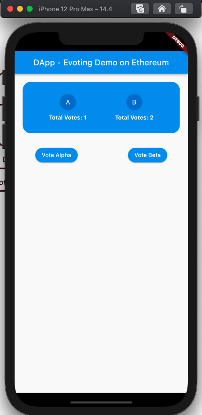
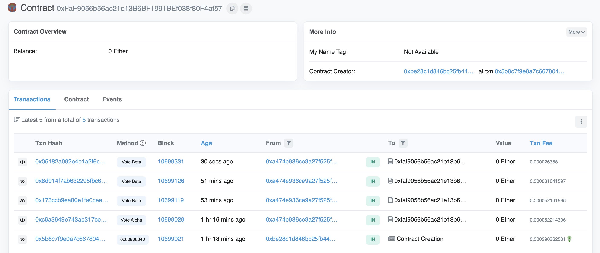

# evoting dapp using Ethereum and Smart Contract

A simple Dapp for voting between two values, which are alpha and beta. 

For the scope of this demonstration, we will not be going into any of the complexities such as verifying a user and the number of times a user can vote; we are just going to focus on creating a simple smart contract in Solidity and deploying it within our application using Flutter.

The idea is to used : 

- [web3dart](https://pub.dev/packages/web3dart) : A dart library that connects to interact with the Ethereum blockchain.
- [Infura’s API suite](https://infura.io/?&utm_source=truffle&utm_medium=referral&utm_campaign=tutorials&utm_content=truffleinfuraguide) that provides instant HTTPS and WebSocket access to the Ethereum and IPFS networks.

## The smart contract 

The smart contract source code used is [here](https://github.com/bwnyasse/blockchain-playground/blob/main/ethereum/projects/evoting/evoting.sol)

 The [ABI (Application Binary Interface)](https://www.quicknode.com/guides/solidity/what-is-an-abi) is [this contract.json file](https://github.com/bwnyasse/blockchain-playground/blob/main/ethereum/DApps/evoting/assets/contract.json)

## Etherscan

I've deployed 2 versions of the smart contract. You can see the interactions with **Vote Alpha** and **Vote Beta**  functions in the smart contract : 

- https://rinkeby.etherscan.io/address/0xFaF9056b56ac21e13B6BF1991BEf038f80F4af57

- https://rinkeby.etherscan.io/address/0x67211973017444d6c1eba1b6cb9b588efdfe4d89

 
